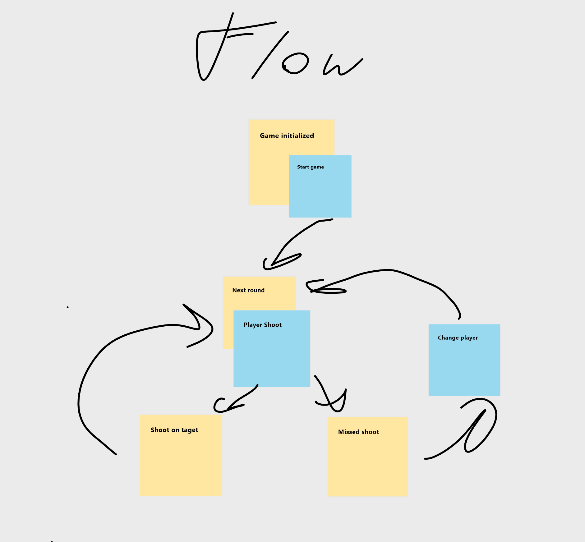

## Battleship
* [General info](#general-info)
* [Technologies](#technologies)
* [Setup](#setup)

## General info
Simply battleship game project that mimic two *AI* player.\
Game state is store on server side.\
Client side predict *shoot* point and display grid with user context



Features
 - Generate game context
 - Assign ships to grid
 - Shoot flow is handle
 
To be implemented:
 - Handle game over event
 - Dummy *AI* shoot algorithm should be replace with sth smarter
 - Assign ships to grid y axis is hardcoded
 - Shoot cannot be duplicates
 - Remove hardcoded/magic numbers data.
 - Add more UTs
 - Errors handling 

## Technologies
Project is created based on dotnet template:
```
$ dotnet new react
```
	
## Setup
To run this project:

```
$ cd ../src/Battleship.App
$ dotnet run
```
First run might take some time cause *npm install*\
Then go to browser *http://localhost:5000*.
